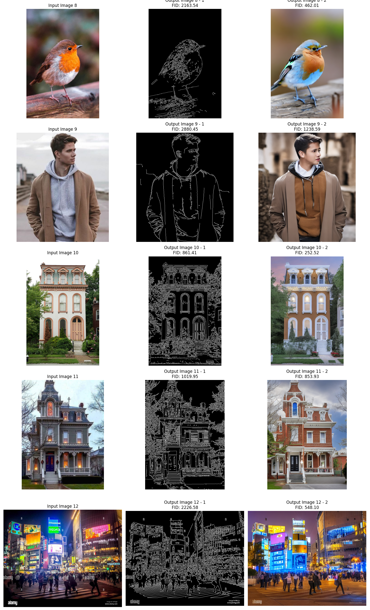

# ControlNet 양자화 및 성능 최적화 프로젝트

ControlNet은 간단한 스케치를 이미지로 변환하는 강력한 모델입니다. 이 프로젝트에서는 ControlNet 모델을 양자화하고 성능을 최적화하여 추론 시간을 단축하는 것을 목표로 합니다. 또한, 이를 갈틱폰 게임에 활용하여 새로운 모드를 구현하는 아이디어를 테스트합니다.

## 프로젝트 개요

이 프로젝트의 목적은 ControlNet 모델을 효율적으로 최적화하여 이미지 생성 작업의 성능을 향상시키는 것입니다. ControlNet은 스케치를 이미지로 변환하는 강력한 딥러닝 모델로, 다양한 응용 프로그램에 사용될 수 있습니다.

특히, 이 프로젝트에서는 모델을 양자화하고 프루닝하여 추론 속도를 높이고 리소스 사용을 줄이는 작업을 수행합니다. 또한, 갈틱폰 게임의 새로운 모드 구현을 통해 AI와의 상호작용을 증대시키는 아이디어도 테스트합니다.

이 프로젝트는 다음과 같은 목표를 가지고 있습니다:

1. **ControlNet 모델의 양자화 및 프루닝**: 모델의 크기를 줄이고 추론 속도를 높이기 위한 작업.
2. **성능 지표 평가**: FID, PSNR, SSIM 등 다양한 성능 지표를 활용하여 모델의 성능을 평가.
3. **Gradio 인터페이스 개선**: Gradio를 사용하여 모델의 결과물을 직관적으로 시각화하고, 사용자 인터페이스를 개선.
4. **ControlNet 1.0과 1.1 비교**: 두 버전 간의 성능 차이를 비교하고, 논문 리뷰를 통해 변경 사항을 확인. [**작업 필요**]
5. **갈틱폰 게임에 AI Bot 도입**: ControlNet을 활용하여 AI가 참여하는 갈틱폰 게임 모드를 구현. [**작업 필요**]


## 주요 기능

- ControlNet 모델의 양자화를 통해 추론 시간 단축
- FID, PSNR, SSIM 등의 성능 지표를 활용한 모델 성능 평가
- Gradio를 통한 인터페이스 제공 및 사용자 인터랙션 개선
- ControlNet 1.0과 1.1 버전 간의 성능 비교 [**작업 필요**]

## 설치 방법

이 프로젝트를 로컬에서 실행하기 위해 다음 단계를 따르세요:

1. 이 저장소를 클론합니다:

    ```bash
    git clone https://github.com/HectorSin/ControlNet.git
    cd ControlNet
    ```

2. Conda 가상환경을 설정하고 필요한 패키지를 설치합니다:

    ```bash
    conda env create -f environment.yaml
    conda activate control-v11
    sudo apt-get update
    sudo apt-get install libsm6 libxext6 libxrender-dev
    ```

3. 필요한 모델 파일을 다운로드하여 `models/` 디렉토리에 저장합니다:

```
cd ./models

curl -LO https://huggingface.co/lllyasviel/ControlNet-v1-1/resolve/main/control_v11p_sd15_canny.pth
curl -LO https://huggingface.co/lllyasviel/ControlNet-v1-1/resolve/main/control_v11p_sd15_mlsd.pth
curl -LO https://huggingface.co/lllyasviel/ControlNet-v1-1/resolve/main/control_v11f1p_sd15_depth.pth
curl -LO https://huggingface.co/lllyasviel/ControlNet-v1-1/resolve/main/control_v11p_sd15_normalbae.pth
curl -LO https://huggingface.co/lllyasviel/ControlNet-v1-1/resolve/main/control_v11p_sd15_seg.pth
curl -LO https://huggingface.co/lllyasviel/ControlNet-v1-1/resolve/main/control_v11p_sd15_inpaint.pth
curl -LO https://huggingface.co/lllyasviel/ControlNet-v1-1/resolve/main/control_v11p_sd15_lineart.pth
curl -LO https://huggingface.co/lllyasviel/ControlNet-v1-1/resolve/main/control_v11p_sd15s2_lineart_anime.pth
curl -LO https://huggingface.co/lllyasviel/ControlNet-v1-1/resolve/main/control_v11p_sd15_openpose.pth
curl -LO https://huggingface.co/lllyasviel/ControlNet-v1-1/resolve/main/control_v11p_sd15_scribble.pth
curl -LO https://huggingface.co/lllyasviel/ControlNet-v1-1/resolve/main/control_v11p_sd15_softedge.pth
curl -LO https://huggingface.co/lllyasviel/ControlNet-v1-1/resolve/main/control_v11e_sd15_shuffle.pth
curl -LO https://huggingface.co/lllyasviel/ControlNet-v1-1/resolve/main/control_v11e_sd15_ip2p.pth
curl -LO https://huggingface.co/lllyasviel/ControlNet-v1-1/resolve/main/control_v11f1e_sd15_tile.pth
curl -LO https://huggingface.co/runwayml/stable-diffusion-v1-5/resolve/main/v1-5-pruned.ckpt
```

베이스 도커 이미지
```
nvidia/cuda:11.1.1-devel-ubuntu20.04
```

## 사용 방법

ControlNet 모델을 실행하여 이미지를 생성하고, 성능을 평가하는 방법:

1. `test_imgs` 디렉토리에 입력 이미지를 추가합니다.
2. ControlNet 모델을 실행하여 이미지를 생성합니다:

    ```bash
    python gradio_app.py  # Gradio 인터페이스를 통해 사용 가능
    ```

3. 생성된 이미지의 성능을 평가하고 시각화하기 위해 다음 명령을 실행합니다:

    ```bash
    python visualize.py  # 성능 지표를 시각화하여 결과물로 저장
    ```

## 성능지표

### FID (Frechet Inception Distance)
FID는 생성된 이미지와 실제 이미지의 통계적 유사성을 측정하는 지표입니다. 낮을수록 품질이 높습니다.

### PSNR (Peak Signal-to-Noise Ratio)
PSNR은 두 이미지 간의 최대 신호 대 잡음 비율을 평가합니다. 값이 클수록 두 이미지가 유사함을 나타냅니다.

### SSIM (Structural Similarity Index)
SSIM은 두 이미지 간의 구조적 유사성을 평가합니다. 값이 1에 가까울수록 유사성이 높습니다.

## 테스트 환경 및 성능 평가

- **테스트 환경**: RTX3090 GPU, Python 3.8, PyTorch 1.12.1
- **평가 지표**: FID, PSNR, SSIM
- **모델 성능 평가**: 양자화 전후의 모델 성능 및 추론 시간 비교

## 모델 정보

이 프로젝트에서는 ControlNet 모델의 다양한 버전과 양자화 여부에 따라 성능을 비교하였습니다.

| 모델 | 버전 | 양자화 | id |
| --- | --- | --- | --- |
| canny | 1.0 | x | a |
| canny | 1.0 | o | b |
| canny | 1.1 | o | c |
| canny | 1.1 | x | d |

각 모델의 ID를 통해 실험 데이터를 구분할 수 있습니다.

### 모델 가중치 크기

양자화 및 프루닝을 통해 모델 가중치 크기를 최적화하였습니다. 각 모델의 가중치 크기는 다음과 같습니다:

| id | weight size (MB) |
| --- | --- |
| a | 5446.203125 |
| b | 1365.8515625 |
| c | 8725.21875 |
| d | 1365.87890625 |

양자화를 통해 모델 크기가 크게 줄어들었음을 확인할 수 있습니다.

### 추론 시간 및 성능 비교

각 모델의 추론 시간을 비교하여 양자화의 영향을 평가하였습니다.

GPU: 1x V100 (16GB)
테스트 코드: 아래의 테스트용 코드와 양자화 모델 전용 테스트 코드를 사용하였으며, 각 샘플에서 측정된 값의 총합을 사용하였습니다.

| id | model loading (s) | inference (s) | max vram (MB) |
| --- | --- | --- | --- |
| a | 5.862994432449341 | 0.3019897937774658 | 15404 |
| b | 3.2166452407836914 | 0.28455471992492676 | 14038 |
| c | 3.8730764389038086 | 0.31455421447753906 | 14038 |
| d | 9.291844606399536 | 0.3257734775543213 | 11238 |

* 양자화된 모델을 사용하는 과정에서 모델의 로드 및 추론 시 시간이 크게 개선되지 않았으며, 이는 연산에서 사용되는 precision이 양자화 이전과 동일하기 때문입니다.

```
for key in state_dict.keys():
    if "weight" in key or "bias" in key:
        state_dict[key] = state_dict[key].dequantize()
```
### 성능 지표

모델의 품질을 평가하기 위해 FID, PSNR, SSIM을 사용했습니다.

| id | fid | Average PSNR | Average SSIM |
| --- | --- | --- | --- |
| a | 1099.709082229354 | 6.659616943402007 | 0.15312470843542905 |
| b | 1637.612544460094 | 5.297666086037641 | 0.03359545908319394 |
| c | 1431.6549796952213 | 6.412770991006596 | 0.12356166210005037 |
| d | 1086.6900126662883 | 6.721158450455801 | 0.16993654150823315 |

## 실험 결과

### 기본 모델

이 이미지에서는 ControlNet 기본 모델을 사용하여 생성된 결과를 볼 수 있습니다.



### 양자화 모델

이 이미지에서는 양자화를 적용한 ControlNet 모델의 결과를 볼 수 있습니다. 성능 지표를 비교해보세요.


## 역할 및 일정

### 역할 분담

- **모델 구현 및 환경 체크**: 신재현
- **프로젝트 구현 및 테스트**: 현동철
- **모델 양자화 및 경량화 작업**: 최호재
- **문헌 조사 및 발표 자료 준비**: 팀원 전체

## 연락처

추가적인 정보나 질문이 있으면 [이메일 주소](mailto:kkang15634@ajou.ac.kr)로 연락해 주세요.